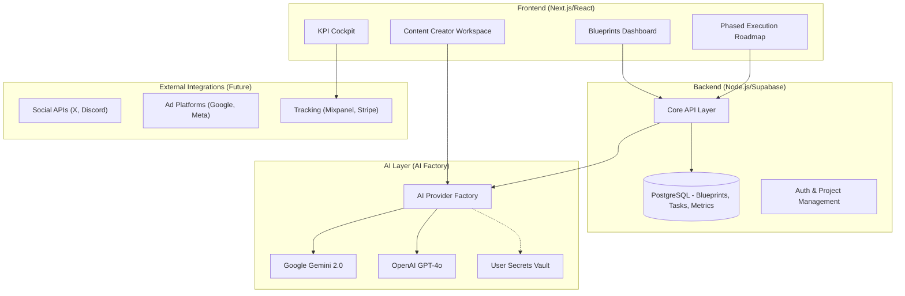

# LaunchGrid: High-Level Architecture & Concept

## Overview
**LaunchGrid** is a generalized AI-driven platform designed to automate, structure, and orchestrate complex digital marketing blueprints for SaaS and digital products. It transforms a static strategy (like the Trading Journal Blueprint) into a dynamic, execution-ready system.

## The Problem
Founders and marketers often have great plans but "get lost in the process" because:
- Strategies are buried in PDFs/Docs.
- Tasks are disconnected from content creation.
- Measurement is manual and lagging.
- Context switching between channels is exhausting.

## Core Concepts (Generalizing the Blueprint)

### 1. The Strategy Engine (Project-Centric Architect)
The system is built hierarchically:
- **Level 1: Project**: The root entity (e.g., "Trading Journal App").
- **Level 2: Pillars**: Mediums involved in the project (Twitter, Discord).
- **Level 3: Workflows**: Sequences of steps (e.g., "Launch Week").
- **Level 4: Steps**: The atomic LEGO blocks.

This ensures that all marketing efforts are **Context-Aware**. A Discord post knows it's part of the "Trading Journal" project and can reference assets from the "Twitter" pillar.

### 2. The Task & Timeline Orchestrator (Cross-Medium Manager)
This engine manages dependencies *across* pillars:
- **Sequential Triggering**: "Only draft the Discord announcement (Step B) AFTER the Twitter thread (Step A) is 12 hours old."
- **Asset Sharing**: The image generated for Instagram is automatically resized and attached to the LinkedIn Post draft.
- **Phased Roadmap**: Manages the rollout phases (Launch, Scale) across all active mediums simultaneously.

### 3. The Content Factory (The "Creator")
Generates channel-specific content aligned with the "Content Pillars" defined in the blueprint:
- **Awareness (TOFU)**: Blog outlines, Infographic ideas.
- **Consideration (MOFU)**: Case studies, YouTube scripts.
- **Conversion (BOFU)**: Ad headlines, Landing page copy.
- **Retention**: Discord lesson plans, community announcements.

### 4. The Analytics Cockpit (The "Navigator")
A simplified dashboard to track the "North Star" metrics:
- **Blended CAC** (Customer Acquisition Cost).
- **LTV** (Life-Time Value).
- **Payback Period**.
- **Channel Efficiency**.

---

## High-Level Architecture

## Detailed Component Breakdown

### 1. Strategy Generator
- **Input**: Product Name, URL, Target Audience (JSON), Budget Range, Core Goal.
- **Output**: A structured `Blueprint` object containing:
    - **Pillar Set**: A list of active channels (both standard and custom).
    - **Pillar Workflows**: Specific automated task sequences for each medium.
    - Content Pillars (Thematic areas).
    - Implementation Phases (0-4).
    - Resource Allocation (Budget %).

### 2. Managed Roadmap
- A Kanban or Gantt-style view.
- Tasks automatically populate based on the Blueprint status.
- Integration with "Content Factory" so a task like "Post Twitter Thread" links directly to a draft.

### 3. The Copilot Bridge (The Automation Key)
This is not just a "helper" but the **Core Automation Engine** for restrictive platforms.

- **Tier 1: Direct API (Fully Autonomous)**
    - **Used for**: Discord, Slack, Email (Resend), Stripe.
    - **Mechanism**: Server-to-Server OAuth. The app posts for you while you sleep.
    - **Risk**: Zero. These platforms encourage bot automation.

- **Tier 2: The Browser Extension ("The Grey Hat Bridge")**
    - **Used for**: X (Twitter), LinkedIn, Instagram, Reddit.
    - **Mechanism**: The extension injects a "Ghost User" script into your browser.
    - **Workflow**:
        1. SaaS schedules a post.
        2. Extension detects the scheduled time.
        3. Extension opens the tab in the background (or uses via active session).
        4. Extension types and clicks "Post" *as if it were you*.
    - **Benefit**: **100% Ban Safe** because it uses your real fingerprint and IP. It bypasses expensive ($5k/mo) Enterprise APIs.

- **Tier 3: Deep Links (Mobile Fallback)**
    - **Used for**: Mobile actions where extensions don't exist.

### 4. Cost Analysis (Infrastructure)
| Service | Role | Est. Cost (MVP) |
| :--- | :--- | :--- |
| **Vercel / Cloudflare** | Hosting | $0 - $20/mo |
| **Supabase** | DB & Auth | $0 - $25/mo |
| **Google Gemini 2.0** | Strategy & Content | $0 (Free tier) |
| **OpenAI GPT-4o** | Optional Strategy | PAYG (BYOK) |
| **Loops / Resend** | Email Lists | $0 - $20/mo |
| **Total** | | **~$50/mo** |

## Risk, Compliance & Automation (2026 Reality)

To prevent bans and ensure maximum reach, Marketing OS follows a **"Human-in-the-Loop" (Copilot)** model:

### 1. The Ban Risk
Social platforms (X, Instagram) penalize "Bot-like" behavior:
- **Autopilot (High Risk)**: Auto-posting via API often results in shadowbans or lower algorithmic reach.
- **Copilot (Safe)**: AI prepares the content, identifies the target thread, and provides a **"Post Link"**. The user clicks to approve and post. This retains the "Human" signature.

### 2. API & Data Sourcing
- **Discord**: High API flexibility for management.
- **X (Twitter) / Socials**: Use Official APIs for data fetching (where budget allows) or browser-based "Assisted Interaction" (User-driven).
- **Monitoring**: AI analyzes public feeds to find "Reply Bait" or "Viral Trends".

---

## Robustness & Scalability Layer

To ensure **LaunchGrid** is enterprise-ready and "rock solid," the following technical guardrails are implemented:

### 1. The Background Worker System (Resilience)
The strategy engine does not run on the main web thread.
- **Workflow Queue**: All `Steps` (AI generation, Scrapes) are pushed to a **Redis/BullMQ queue**.
- **Retry Logic**: If an AI provider (Gemini) or a Social API is down, the system uses **Exponential Backoff** to retry without user intervention.
- **Isolation**: Each LEGO step runs in a "Sandbox" (isomorphic function). A failure in one pillar (e.g., Twitter scan) cannot crash another (e.g., Discord management).

### 2. Encrypted Secret Management (Security)
- **Vaulting**: All OAuth tokens and API keys are encrypted at rest using **AES-256-GCM** with a master key stored in an Environment Secret Manager (e.g., Vercel Secrets/AWS KMS).
- **Scope Limitation**: The tool only requests the minimum required permissions (e.g., `post` and `read` scope, never full account access).

### 3. The Audit & Decision Log (Traceability)
Every AI action is logged with its "Reasoning Chain":
- **Input Context**: What data was used?
- **AI Rationale**: Why did the LLM choose this specific hook?
- **User Approval**: Timestamp and ID of the human who approved the Copilot post.

### 4. Rate-Limit Orchestrator (Polite Automation)
A central service that tracks API usage across all active pillars. It pauses or "sleeps" workflows if the tool approaches the rate limits of X, LinkedIn, or Instagram to protect the user's reputation and account status.
