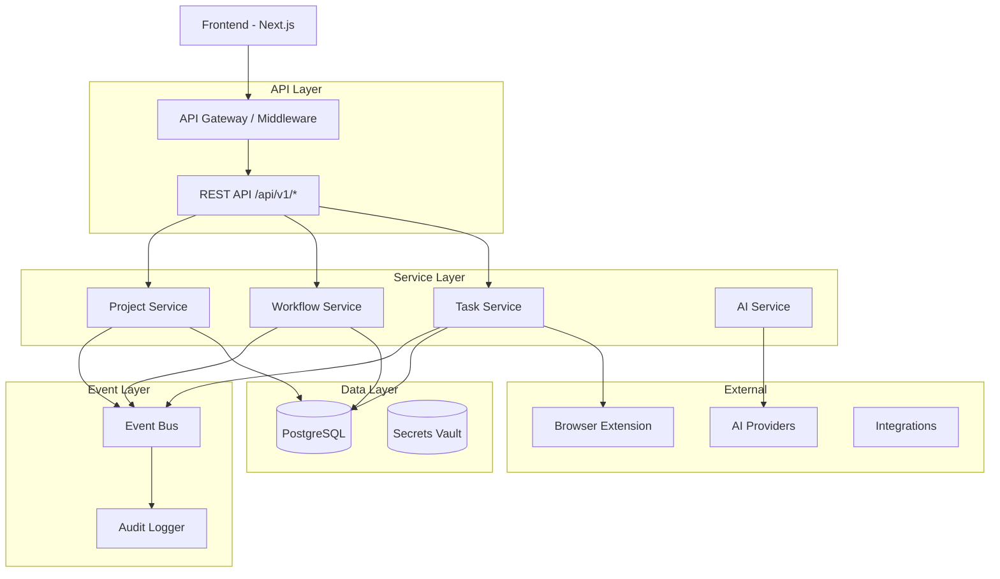

# architecture.md — LaunchGrid (Marketing Automation OS)

## Overview

**LaunchGrid** is an AI-driven Marketing Automation OS that converts a marketing strategy into an executable, measurable, multi-channel system.

It is designed around **event-driven architecture** with **strict service ownership**:

### Core Engines (5 Decoupled Services)

1. **Strategy Engine** — creates structured marketing blueprints
2. **Orchestration Engine** — manages tasks, dependencies, and timelines
3. **Content Engine** — generates channel-specific assets
4. **Execution Engine** — safely interacts with external platforms
5. **Analytics Engine** — measures real business outcomes

The system is **API-first**, **modular**, **LLM-friendly**, **tenant-isolated**, and **compliance-safe**.

---

## Architecture Constitution Compliance

This codebase follows the LaunchGrid Architecture Constitution (see `.agent/rules/launchgrid.md`):

| Principle | Implementation |
|-----------|----------------|
| API-first | REST API at `/api/v1/*` with proper versioning |
| Event-driven | Event bus with domain events for all actions |
| Strict service ownership | Service layer in `/lib/services/` |
| Multi-tenant | Organizations table with tenant isolation |
| AI as async workers | AI Service with event-based triggering |
| Declarative workflows | State machine-based workflow engine |
| Human-in-the-loop | Approval gates for social posting |
| Audit trail | Comprehensive logging in `/lib/events/audit-logger.ts` |
| Encrypted secrets | AES-256-GCM encryption in `/utils/encryption.ts` |

---

## System Architecture



---

## Data Model Hierarchy

### Entity Relationships

```
Organization (Tenant)
 └── Users (Members)
 └── Projects
      ├── Pillars (Channels)
      │    └── Workflows
      │         └── Steps (atomic LEGO blocks)
      │              └── Tasks (execution instances)
      └── Content Assets
```

### Key Objects

| Object | Description |
|--------|-------------|
| **Organization** | Tenant container for isolation |
| **Project** | Marketing system for one product |
| **Pillar** | Channel/medium (X, LinkedIn, Blog, etc.) |
| **Workflow** | Sequence of steps for a specific goal |
| **Step** | Atomic executable unit (LEGO block) |
| **Task** | Runtime instance of a step |

---

## Directory Structure

```
/workspace
├── app/
│   ├── api/
│   │   ├── v1/                    # REST API endpoints
│   │   │   ├── projects/          # Project CRUD
│   │   │   ├── workflows/         # Workflow execution
│   │   │   └── extension/         # Browser extension API
│   │   └── health/                # Health check
│   ├── actions/                   # Server actions (UI layer)
│   └── dashboard/                 # UI pages
├── lib/
│   ├── core/
│   │   ├── types.ts              # TypeScript interfaces
│   │   ├── errors.ts             # Error handling system
│   │   └── validation.ts         # Zod schemas
│   ├── events/
│   │   ├── event-bus.ts          # Event pub/sub system
│   │   └── audit-logger.ts       # Audit trail logging
│   ├── services/
│   │   ├── base-service.ts       # Service base class
│   │   ├── project-service.ts    # Project operations
│   │   ├── workflow-service.ts   # Workflow engine
│   │   ├── task-service.ts       # Task lifecycle
│   │   └── ai-service.ts         # AI operations
│   └── api/
│       └── middleware.ts         # API auth, rate limiting
├── utils/
│   ├── ai/                       # AI provider implementations
│   ├── supabase/                 # Database clients
│   └── encryption.ts             # Secrets encryption
└── supabase/
    └── migrations/               # Database schema
```

---

## Service Layer

### Base Service Pattern

All services extend `BaseService` which provides:
- Tenant context validation
- Event emission
- Audit logging
- Error handling

```typescript
class MyService extends BaseService {
  protected serviceName = 'MyService';
  protected aggregateType = 'resource';

  async create(input: CreateDTO): Promise<Resource> {
    return this.execute('create', async () => {
      // Validate input
      const validated = validateInput(schema, input);
      
      // Business logic
      const result = await this.db.from('table').insert(...);
      
      // Emit event
      await this.emitEvent('RESOURCE_CREATED', result.id, { ... });
      
      // Audit
      await this.audit('create', result.id, { ... });
      
      return result;
    });
  }
}
```

### Available Services

| Service | Responsibility |
|---------|---------------|
| `ProjectService` | Project CRUD, blueprint storage |
| `WorkflowService` | Workflow state machine, step management |
| `TaskService` | Task lifecycle, status transitions |
| `AIService` | AI provider abstraction, content generation |

---

## Event System

### Event Types

```typescript
type EventType =
  // Project Events
  | 'PROJECT_CREATED'
  | 'PROJECT_UPDATED'
  | 'PROJECT_DELETED'
  | 'BLUEPRINT_GENERATED'
  // Workflow Events
  | 'WORKFLOW_CREATED'
  | 'WORKFLOW_STARTED'
  | 'WORKFLOW_COMPLETED'
  | 'WORKFLOW_FAILED'
  // Task Events
  | 'TASK_CREATED'
  | 'TASK_STARTED'
  | 'TASK_COMPLETED'
  | 'TASK_FAILED'
  // AI Events
  | 'AI_GENERATION_STARTED'
  | 'AI_GENERATION_COMPLETED'
  | 'AI_GENERATION_FAILED'
  // ...
```

### Event Flow

```
User Action → Server Action → Service → Event Emitted → Audit Logged
                                    ↓
                            Subscribers Notified
```

---

## Workflow State Machine

### Workflow States

```
idle → running → completed
         ↓
       paused → running
         ↓
       failed → idle (reset)
```

### Task States

```
pending → in_progress → review_needed → completed
              ↓              ↓
         extension_queued    ↓
              ↓         cancelled
           failed → pending (retry)
```

---

## API Layer

### REST API Endpoints

| Endpoint | Method | Description |
|----------|--------|-------------|
| `/api/v1/projects` | GET | List projects |
| `/api/v1/projects` | POST | Create project |
| `/api/v1/projects/:id` | GET | Get project |
| `/api/v1/projects/:id` | PATCH | Update project |
| `/api/v1/projects/:id` | DELETE | Delete project |
| `/api/v1/workflows/:id/execute` | POST | Execute workflow step |
| `/api/v1/extension/tasks` | GET | Get extension task |
| `/api/v1/extension/tasks` | POST | Submit task result |

### Middleware Features

- **Authentication**: Session-based (Supabase) or API key
- **Rate Limiting**: Configurable per endpoint type
- **CORS**: Proper origin validation
- **Request ID**: Tracking for debugging
- **Error Normalization**: Consistent error responses

---

## Security

### Encryption

- API keys encrypted with AES-256-GCM
- Unique IV per encryption
- Authentication tag validation

### Tenant Isolation

- Row Level Security (RLS) on all tables
- Organization-scoped queries in services
- User context validation in middleware

### Audit Trail

- All actions logged with:
  - User ID
  - Organization ID
  - Request ID
  - IP Address
  - Changes (old/new values)

---

## Database Schema

### Core Tables

```sql
-- Multi-tenancy
organizations (id, name, slug, settings)
organization_members (organization_id, user_id, role)

-- Projects
projects (id, organization_id, user_id, name, context, status)
pillars (id, project_id, type, name, config, status)
workflows (id, project_id, pillar_id, name, config, status)
steps (id, workflow_id, type, config, dependency_ids, position)
tasks (id, step_id, project_id, status, output_data, retry_count)

-- Security
user_secrets (user_id, openai_key, gemini_key, ...)
api_keys (id, user_id, key_hash, scopes, expires_at)

-- Observability
audit_logs (id, organization_id, user_id, action, resource_type, ...)
domain_events (id, event_type, aggregate_id, payload, occurred_at)
```

---

## Infrastructure (MVP)

| Service | Role | Notes |
|---------|------|-------|
| **Vercel** | Hosting | Edge functions for API |
| **Supabase** | DB/Auth | PostgreSQL + RLS |
| **Google Gemini** | AI (Default) | Free tier available |
| **OpenAI** | AI (Premium) | BYOK model |
| **Browser Extension** | Execution | Human-in-the-loop |

---

## What LaunchGrid Is

A **Marketing Execution OS** that:

1. **Generates** structured marketing strategies via AI
2. **Orchestrates** multi-channel campaigns with declarative workflows
3. **Ensures** human approval for social actions (compliance)
4. **Tracks** all decisions with full audit trail
5. **Scales** via event-driven, stateless architecture

---

## Future Roadmap

See `docs/roadmap.md` for planned features:

- Redis-backed event persistence
- Webhook integrations
- Real-time analytics dashboard
- Team collaboration features
- Custom workflow templates
