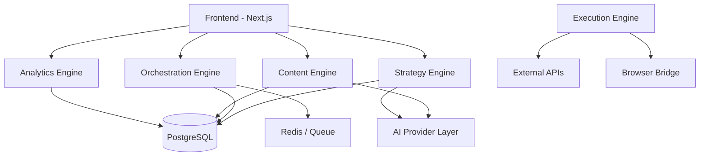

# architecture.md — LaunchGrid (Marketing Automation OS)

## Overview

**LaunchGrid** is an AI-driven Marketing Automation OS that converts a marketing strategy into an executable, measurable, multi-channel system.

It is designed around 5 decoupled engines:

1. **Strategy Engine** — creates structured marketing blueprints
2. **Orchestration Engine** — manages tasks, dependencies, and timelines
3. **Content Engine** — generates channel-specific assets
4. **Execution Engine** — safely interacts with external platforms
5. **Analytics Engine** — measures real business outcomes

The system is **API-first**, **modular**, **LLM-friendly**, and **compliance-safe**.

---

## Core Design Principles

- API > automation hacks
- Human-in-the-loop for social actions (or transparent delegation)
- Every action traceable and auditable
- Every module independently scalable
- LLMs operate as stateless workers over structured objects
- Strict separation of: Strategy / Tasks / Content / Execution / Metrics

---

## System Domains (High Level)



## Data Model Hierarchy (LLM-Friendly)
Everything revolves around structured objects.

### Project Tree
```
Project
 ├── Pillars (Channels)
 │     ├── Workflows
 │     │     ├── Steps (atomic tasks)
```

### Key Objects
*   **Project**: Represents one product/company marketing system.
*   **Pillar (Channel)**: A channel or medium (X, LinkedIn, Blog, Email, Discord, Ads).
*   **Workflow**: A sequence of steps for a specific goal (Launch, Weekly Content, Lead Magnet).
*   **Step (Atomic Unit)**: The smallest executable unit.

### LLMs only reason at Step level.
Examples: "Generate Twitter thread", "Create blog outline", "Draft email".

---

## 1. Strategy Engine
**Role**: Transforms user input into a structured Blueprint.

*   **Input**: Product URL, Target audience, Budget, Goals.
*   **Output**: A Blueprint JSON object (Pillars, Workflows, Content Themes, Budget).
*   **Notes**: Pure AI + JSON generation. No side effects. Can be regenerated anytime.

## 2. Orchestration Engine (The Brain)
**Role**: Turns Blueprint into actionable roadmap.

*   **Responsibilities**: Dependency management, Timeline scheduling, Queueing background jobs.
*   **Important**: A Step never runs directly. It is queued.

## 3. Content Engine (AI Factory)
**Role**: Generate all content assets.

*   **AI Provider Abstraction**: `AIProvider.generate(type, context) -> asset`
*   **Output**: Structured ContentAsset (stored before execution).

## 4. Execution Engine (The Hands)
**Role**: Interface with external platforms safely.

### Execution Modes

**Mode 1 — Direct API (Preferred)**
*   **Used for**: Discord, Email (Resend), Slack, CMS, Ads platforms.
*   **Mechanism**: Server-to-Server OAuth.

**Mode 2 — Human Approval Flow (Deep Links)**
*   **Used for**: Mobile actions, or strict compliance.
*   **Mechanism**: User receives "Ready to Post" -> Clicks Deep Link -> Posts manually.
*   **Benefit**: 100% compliance, Human fingerprint.

**Mode 3 — Browser Bridge Extension (Distributed)**
*   **Used for**: Power Users on X (Twitter), LinkedIn, Reddit.
*   **Mechanism**: A local browser extension polls the Orchestrator for tasks (e.g., "Scan Feed", "Draft Reply") and executes them in the user's active session.
*   **Benefit**: Bypasses costly Enterprise APIs while maintaining a real user fingerprint (Simulates human interaction).

## 5. Analytics Engine (Business Metrics)
**Role**: Measure KPIs (CAC, LTV, Payback, Effectiveness), not just vanity metrics.

---

## Infrastructure (MVP)
| Service | Role | Cost |
| :--- | :--- | :--- |
| **Vercel** | Hosting | Low |
| **Supabase** | DB/Auth | Low |
| **Google Gemini** | AI (Strategy) | Free Tier |
| **Browser Ext** | Scraping/Posting | Free |

## What LaunchGrid Is
It is a **Marketing Execution OS** that blends API automation with human-assisted actions.
